# 3SafeTrade - Flow Completo del Sito

> Documentazione tecnica completa di tutti i flussi dell'applicazione con diagrammi.

---

## Indice

1. [Architettura Generale](#1-architettura-generale)
2. [Stack Tecnologico](#2-stack-tecnologico)
3. [Ruoli Utente](#3-ruoli-utente)
4. [Autenticazione](#4-autenticazione)
5. [Marketplace - Listing](#5-marketplace---listing)
6. [Proposta e Transazione](#6-proposta-e-transazione)
7. [Escrow Locale (Shop)](#7-escrow-locale-shop)
8. [Escrow Verificato (Hub)](#8-escrow-verificato-hub)
9. [SafeVault - Deposito](#9-safevault---deposito)
10. [SafeVault - Richiesta Teca](#10-safevault---richiesta-teca)
11. [SafeVault - Vendita Online](#11-safevault---vendita-online)
12. [SafeVault - Vendita Fisica](#12-safevault---vendita-fisica)
13. [Revenue Split & Payouts](#13-revenue-split--payouts)
14. [Sistema Notifiche](#14-sistema-notifiche)
15. [Admin Workflows](#15-admin-workflows)
16. [Community](#16-community)
17. [Subscription & Premium](#17-subscription--premium)
18. [Mappa Route Completa](#18-mappa-route-completa)

---

## 1. Architettura Generale


### Struttura Cartelle Principale

```
3SafeTrade/
├── prisma/schema.prisma          # Schema DB completo
├── src/
│   ├── app/
│   │   ├── (auth)/               # Login, Signup
│   │   ├── (marketplace)/        # Listings, Transaction, Shops
│   │   ├── (user)/               # Dashboard utente
│   │   ├── admin/                # Pannello admin
│   │   ├── merchant/             # Pannello merchant
│   │   ├── vault/                # Pagine vault utente
│   │   ├── escrow/               # Pagine escrow
│   │   ├── sell/                 # Pagina vendita
│   │   └── api/                  # Tutte le API routes
│   ├── components/               # Componenti React
│   ├── lib/                      # Utility, auth, escrow, vault
│   ├── hooks/                    # React hooks
│   └── types/                    # TypeScript types
```

---

## 2. Stack Tecnologico

| Layer | Tecnologia |
|-------|-----------|
| Framework | Next.js 14 (App Router) |
| Language | TypeScript |
| Database | PostgreSQL |
| ORM | Prisma |
| Auth | Supabase Auth |
| Storage | Supabase Storage + Cloudinary |
| UI | React 18, Tailwind CSS, Radix UI |
| Shipping | Shippo API |
| QR Codes | qrcode (generazione), scanner custom |

---

## 3. Ruoli Utente

```mermaid
graph LR
    USER["👤 USER<br/>Utente base"]
    MERCHANT["🏪 MERCHANT<br/>Negozio"]
    MODERATOR["🛡️ MODERATOR<br/>Moderatore"]
    ADMIN["⚙️ ADMIN<br/>Amministratore"]
    HUB_STAFF["📦 HUB_STAFF<br/>Staff Hub"]

    USER -->|"Richiede merchant"| MERCHANT
    USER -.->|"Promosso da admin"| MODERATOR

    style ADMIN fill:#dc2626,color:#fff
    style MERCHANT fill:#2563eb,color:#fff
    style MODERATOR fill:#7c3aed,color:#fff
    style HUB_STAFF fill:#d97706,color:#fff
    style USER fill:#059669,color:#fff
```



| Ruolo | Permessi |
|-------|----------|
| **USER** | Crea listing, propone trade/acquisti, deposita nel vault, ordina online |
| **MERCHANT** | Gestisce negozio, inventario vault, scansiona QR, evade ordini, verifica escrow |
| **MODERATOR** | Approva release fondi, gestisce dispute |
| **ADMIN** | Tutto: approva merchant, listing, gestisce vault, hub, payouts |
| **HUB_STAFF** | Riceve pacchi, verifica carte, gestisce depositi vault |

---

## 4. Autenticazione


### Middleware Auth

```
Richiesta → supabase/middleware.ts → Refresh session → Route handler
                                   ↓ (se /dashboard/* non auth)
                              Redirect → /login
```

### Helper Functions (`src/lib/auth.ts`)

- `getSession()` → Sessione leggera (solo Supabase)
- `getCurrentUser()` → User completo (Supabase + Prisma)
- `requireAuth()` → Blocca se non autenticato
- `requireRole(role)` → Blocca se ruolo sbagliato
- `requireEmailVerified()` → Blocca se email non verificata

---

## 5. Marketplace - Listing

### 5.1 Creazione Listing

```mermaid
flowchart TD
    A[Utente va su /sell o /listings/create] --> B{Tipo vendita?}
    
    B -->|"P2P Diretto"| C[Form Listing Diretto]
    B -->|"SafeVault"| D[Form Listing SafeVault]
    
    C --> E["Compila campi:<br/>Title, Game, Condition,<br/>Type (SALE/TRADE/BOTH),<br/>Price, Images 1-5"]
    
    D --> F["Compila campi + Prezzo min €40<br/>Accetta termini SafeVault<br/>Split: 70% owner / 20% shop / 10% platform"]
    
    E --> G{Auto-approval?}
    F --> G
    
    G -->|"Email verificata OR<br/>Account > 7gg OR<br/>Karma positivo OR<br/>Ha listing precedenti"| H[✅ Listing ACTIVE]
    G -->|"Nessun criterio"| I[⏳ Listing PENDING<br/>Richiede approvazione admin]
    
    H --> J[Visibile nel marketplace]
    I --> K[Admin riceve notifica]
    K --> L{Admin decision}
    L -->|Approva| H
    L -->|Rifiuta| M[❌ Listing REJECTED]

    D --> N["Crea VaultDeposit + VaultItem<br/>collegati alla listing"]
```



### 5.2 Browsing e Filtri

```mermaid
flowchart LR
    subgraph Filtri
        F1["🔍 Ricerca testo"]
        F2["🎮 Game: Pokemon, Magic,<br/>Yu-Gi-Oh, One Piece, Digimon"]
        F3["📊 Condizione: MINT → POOR"]
        F4["💰 Range prezzo"]
        F5["📍 Città venditore"]
        F6["👤 Tipo: Collector / Shop"]
        F7["🏷️ Modalità: P2P / SafeVault"]
        F8["📐 Ordinamento"]
    end

    subgraph Risultati
        R1["Featured (In Vetrina)"]
        R2["Early Access<br/>(solo Premium/PRO)"]
        R3["Listing Pubblici"]
    end

    Filtri --> R3
```



**Paginazione:** 20 listing per pagina
**Early Access:** Utenti Premium/PRO vedono listing EARLY_ACCESS prima che diventino PUBLIC

---

## 6. Proposta e Transazione

### 6.1 Flow Completo: Da Listing a Transazione

```mermaid
sequenceDiagram
    actor Buyer as Compratore
    actor Seller as Venditore
    participant MP as Marketplace
    participant API as API
    participant DB as Database

    Buyer->>MP: Visualizza listing /listings/[id]
    Buyer->>MP: Click "Fai Proposta"
    MP->>MP: /listings/[id]/propose
    
    Note over Buyer,MP: Compila proposta:<br/>Prezzo offerta / Carte per trade<br/>Messaggio opzionale<br/>Chi paga fee (5%): SELLER/BUYER/SPLIT

    Buyer->>API: POST /api/proposals
    API->>DB: Crea Proposal (PENDING)
    API->>DB: Notifica al venditore
    DB-->>Seller: 🔔 Nuova proposta ricevuta

    Seller->>MP: /dashboard/proposals/received
    
    alt Accetta
        Seller->>API: PUT /api/proposals/[id] (ACCEPTED)
        API->>DB: Proposal → ACCEPTED
        API->>DB: Notifica al compratore
        
        Note over Seller,API: Venditore sceglie metodo escrow
        
        alt Escrow Locale (in negozio)
            Seller->>API: POST /api/transactions<br/>{type: LOCAL, shopId, date}
            API->>DB: Crea SafeTradeTransaction
            API->>DB: Crea EscrowSession + QR
        else Escrow Verificato (via hub)
            Seller->>API: POST /api/transactions<br/>{type: VERIFIED}
            API->>DB: Crea SafeTradeTransaction
        end
        
    else Rifiuta
        Seller->>API: PUT /api/proposals/[id] (REJECTED)
    else Annulla
        Buyer->>API: PUT /api/proposals/[id] (CANCELLED)
    end
```



### 6.2 Fee SafeTrade

La piattaforma applica una fee del **5%** sul valore della transazione. La fee può essere pagata da:
- **SELLER** → Il venditore paga tutto
- **BUYER** → Il compratore paga tutto
- **SPLIT** → 2.5% ciascuno

---

## 7. Escrow Locale (Shop)

```mermaid
sequenceDiagram
    actor B as Compratore
    actor S as Venditore
    actor M as Merchant (Negozio)
    participant SYS as Sistema

    Note over B,SYS: Transazione creata con escrow LOCAL

    SYS->>B: 🔔 Appuntamento confermato
    SYS->>S: 🔔 Appuntamento confermato
    SYS->>M: 🔔 Nuovo appuntamento

    Note over B,SYS: Giorno dell'appuntamento

    B->>M: Mostra QR Code dal telefono
    S->>M: Mostra QR Code dal telefono
    M->>SYS: Scansiona QR → Check-in entrambi

    SYS->>SYS: EscrowSession: CHECKIN_PENDING → CHECKED_IN

    M->>SYS: Verifica carta (condizione, autenticità)
    
    alt Verifica OK
        SYS->>SYS: VERIFICATION_PASSED
        M->>SYS: Conferma scambio
        SYS->>SYS: Pagamento rilasciato
        SYS->>SYS: Transazione COMPLETED
        SYS->>B: 🔔 Transazione completata
        SYS->>S: 🔔 Pagamento ricevuto
    else Verifica FALLITA
        SYS->>SYS: VERIFICATION_FAILED
        SYS->>B: 🔔 Verifica fallita
        SYS->>S: 🔔 Verifica fallita - carta non conforme
    end
```



### Stati EscrowSession (Locale)


---

## 8. Escrow Verificato (Hub)

```mermaid
sequenceDiagram
    actor S as Venditore
    actor Hub as SafeTrade Hub
    actor B as Compratore
    participant SYS as Sistema

    Note over S,SYS: Transazione creata con escrow VERIFIED

    S->>SYS: Genera etichetta spedizione<br/>/transaction/[id]/verified-escrow/generate-label
    SYS->>S: 📄 Etichetta Shippo

    S->>Hub: 📦 Spedisce carta all'Hub
    SYS->>SYS: Tracking attivo

    Hub->>SYS: POST /hub/packages/[id]/receive<br/>Pacco ricevuto
    Hub->>SYS: POST /hub/packages/[id]/start-verification<br/>Inizia verifica

    alt Verifica OK
        Hub->>SYS: POST /hub/packages/[id]/verify<br/>{passed: true}
        Hub->>SYS: POST /hub/packages/[id]/ship-to-buyer<br/>Spedisce al compratore
        SYS->>B: 📦 Pacco in arrivo
        B->>SYS: Conferma ricezione
        SYS->>SYS: Transazione COMPLETED
        SYS->>S: 💰 Pagamento rilasciato
    else Verifica FALLITA
        Hub->>SYS: POST /hub/packages/[id]/verify<br/>{passed: false}
        Hub->>S: 📦 Carta rispedita al venditore
        SYS->>B: 💰 Rimborso
    end
```



### Rilascio Fondi (Double Confirmation)

```mermaid
flowchart TD
    A[Transazione completata] --> B[PendingRelease creato]
    B --> C[Admin 1: Initiate Approval]
    C --> D[Admin 2: Confirm Approval]
    D --> E[Fondi rilasciati al venditore]
    
    C --> F{Timeout 48h?}
    F -->|Sì| G[Auto-release]
    
    B --> H[Admin: Reject]
    H --> I[Rilascio bloccato → Investigazione]
```



---

## 9. SafeVault - Deposito

### 9.1 Flow Completo Deposito

```mermaid
sequenceDiagram
    actor U as Utente (Owner)
    actor Hub as SafeTrade Hub
    actor Admin as Admin/Staff
    actor M as Merchant

    Note over U,M: === FASE 1: CREAZIONE DEPOSITO ===
    U->>U: /vault/deposit/new
    U->>Hub: POST /api/vault/deposits<br/>{items: [{game, name, set, condition, photos}]}
    Hub-->>U: Deposit CREATED + istruzioni spedizione

    Note over U,M: === FASE 2: SPEDIZIONE ===
    U->>Hub: POST /deposits/[id]/mark-shipped<br/>{trackingIn: "XX123"}
    U->>Hub: 📦 Spedisce carte fisicamente

    Note over U,M: === FASE 3: RICEZIONE ===
    Admin->>Hub: POST /deposits/[id]/receive
    Hub-->>Hub: Deposit: CREATED → RECEIVED
    Hub-->>U: 🔔 Deposito ricevuto all'Hub

    Note over U,M: === FASE 4: REVISIONE ===
    Admin->>Hub: POST /deposits/[id]/review<br/>{items: [{id, status: ACCEPT/REJECT,<br/>conditionVerified, priceFinal}]}
    
    Hub-->>Hub: Items → ACCEPTED / REJECTED
    Hub-->>Hub: Deposit → ACCEPTED / PARTIAL / REJECTED
    Hub-->>U: 🔔 Revisione completata

    Note over U,M: === FASE 5: DISTRIBUZIONE ===
    Admin->>Hub: POST /vault/items/assign<br/>{itemId, shopId, caseId?, slotId?}
    Hub-->>Hub: Item → ASSIGNED_TO_SHOP (o IN_CASE)
    Hub-->>Hub: Deposit → DISTRIBUTED
    Hub-->>M: 🔔 Nuovo item assegnato

    Note over U,M: === FASE 6: IN TECA ===
    M->>M: Scansiona QR slot nella teca
    M->>Hub: Assegna item allo slot
    Hub-->>Hub: Item → IN_CASE, Slot → OCCUPIED
```



### 9.2 Stati VaultDeposit


### 9.3 Stati VaultItem


---

## 10. SafeVault - Richiesta Teca

### 10.1 Flow Richiesta Teca Merchant


### 10.2 Stati VaultCaseRequest


### 10.3 Struttura Teca

```
VaultCase (Teca Branded)
├── 30 Slot fisici (S01 → S30)
│   ├── Ogni slot ha QR token univoco
│   ├── Stato: FREE / OCCUPIED
│   └── Collegato a VaultItem quando occupato
├── Status: IN_HUB → IN_TRANSIT → IN_SHOP_ACTIVE → RETIRED
└── Collegata a Shop via authorizedShopId
```

---

## 11. SafeVault - Vendita Online

```mermaid
sequenceDiagram
    actor B as Compratore
    actor M as Merchant
    participant SYS as Sistema
    actor O as Owner (Proprietario carta)

    Note over B,O: Item è IN_CASE o LISTED_ONLINE

    M->>SYS: Pubblica item online<br/>Item: IN_CASE → LISTED_ONLINE

    B->>SYS: Visualizza listing su marketplace
    B->>SYS: POST /api/vault/orders<br/>Crea ordine
    SYS->>SYS: Order: PENDING_PAYMENT<br/>Item: LISTED_ONLINE → RESERVED

    B->>SYS: POST /vault/orders/[id]/pay<br/>Conferma pagamento
    SYS->>SYS: Order: PENDING_PAYMENT → PAID
    SYS->>M: 🔔 Nuovo ordine da evadere!

    M->>SYS: POST /vault/merchant/orders/[id]/fulfill<br/>{trackingNumber, shippingLabel}
    SYS->>SYS: Order: PAID → FULFILLING → SHIPPED
    SYS->>B: 🔔 Ordine spedito!

    B->>SYS: Conferma ricezione
    SYS->>SYS: Order: SHIPPED → DELIVERED
    SYS->>SYS: Item: RESERVED → SOLD

    Note over SYS: Revenue Split automatico
    SYS->>SYS: Crea VaultSplit
    SYS->>O: 💰 70% del prezzo
    SYS->>M: 💰 20% del prezzo
    SYS->>SYS: 💰 10% piattaforma
```



### Stati VaultOrder


---

## 12. SafeVault - Vendita Fisica

```mermaid
sequenceDiagram
    actor C as Cliente (in negozio)
    actor M as Merchant
    participant SYS as Sistema
    actor O as Owner

    C->>M: "Vorrei questa carta" (indica teca)
    M->>SYS: Scansiona QR slot della teca
    SYS-->>M: Mostra dettagli item + prezzo

    M->>SYS: POST /vault/merchant/sales<br/>{itemId, price, paymentMethod}
    SYS->>SYS: VaultSale creato
    SYS->>SYS: Item: IN_CASE → SOLD
    SYS->>SYS: Slot: OCCUPIED → FREE

    Note over SYS: Revenue Split automatico
    SYS->>SYS: Crea VaultSplit
    SYS->>O: 💰 70% del prezzo
    SYS->>M: 💰 20% del prezzo
    SYS->>SYS: 💰 10% piattaforma
```



---

## 13. Revenue Split & Payouts

### 13.1 Split Standard SafeVault


### 13.2 Flow Payout


### 13.3 Stati VaultSplit

```mermaid
stateDiagram-v2
    [*] --> PENDING: Vendita completata
    PENDING --> ELIGIBLE: Hold period scaduto
    ELIGIBLE --> IN_PAYOUT: Aggiunto a batch
    IN_PAYOUT --> PAID: Batch processato
    PAID --> [*]
```

---

## 14. Sistema Notifiche

### 14.1 Tipi di Notifica Utente

| Tipo | Trigger | Destinatario |
|------|---------|-------------|
| `PROPOSAL_RECEIVED` | Nuova proposta su listing | Venditore |
| `PROPOSAL_ACCEPTED` | Proposta accettata | Compratore |
| `TRANSACTION_CREATED` | Transazione creata | Entrambi |
| `ESCROW_SESSION_CREATED` | Sessione escrow pronta | Entrambi |
| `price_alert` | Listing matcha alert prezzo | Utente con alert |
| Vault deposit update | Deposito ricevuto/revisionato | Depositante |
| Vault order | Nuovo ordine / spedito | Merchant / Compratore |

### 14.2 Notifiche Admin

| Tipo | Trigger |
|------|---------|
| `LISTING_PENDING` | Listing richiede approvazione |
| `VAULT_CASE_REQUEST` | Nuova richiesta teca |
| Payment confirmation | Merchant conferma pagamento teca |
| Deposit received | Deposito ricevuto all'hub |

### 14.3 Componenti

- `NotificationBell.tsx` → Bell icon per utenti nel header
- `AdminNotificationBell.tsx` → Bell icon per admin

---

## 15. Admin Workflows

### 15.1 Panoramica Admin

```mermaid
flowchart TD
    subgraph Admin["Pannello Admin /admin"]
        A1["📋 Applications<br/>Approva merchant"]
        A2["📦 Listings<br/>Approva/rifiuta listing"]
        A3["👥 Users<br/>Gestione utenti"]
        A4["🏪 Shops<br/>Gestione negozi"]
        A5["💳 Transactions<br/>Monitor transazioni"]
        A6["⚖️ Disputes<br/>Gestione dispute"]
        A7["📦 Hub Packages<br/>Verifica pacchi"]
        A8["💰 Pending Releases<br/>Rilascio fondi"]
        A9["🏛️ Vault Requests<br/>Richieste teca"]
        A10["📊 Reports & Stats"]
        A11["🔍 Audit Log"]
    end
```

### 15.2 Approvazione Merchant

```mermaid
flowchart TD
    A[Utente richiede di diventare Merchant] --> B[MerchantApplication PENDING]
    B --> C{Admin review}
    C -->|Approva| D[Application APPROVED]
    D --> E[User.role → MERCHANT]
    E --> F[Shop creato automaticamente]
    C -->|Rifiuta| G[Application REJECTED]
```

### 15.3 Gestione Hub (Escrow Verificato)

```mermaid
flowchart TD
    A[Pacco arriva all'Hub] --> B[Receive: marca ricevuto]
    B --> C[Start Verification]
    C --> D{Verifica carta}
    D -->|✅ OK| E[Verify: passed=true]
    E --> F[Ship to Buyer]
    F --> G[Buyer conferma ricezione]
    G --> H[Pending Release creato]
    H --> I[Admin 1: Initiate]
    I --> J[Admin 2: Confirm]
    J --> K[💰 Fondi rilasciati]
    
    D -->|❌ Fail| L[Verify: passed=false]
    L --> M[Carta rispedita al venditore]
    M --> N[💰 Rimborso al compratore]
```

---

## 16. Community

```mermaid
flowchart TD
    subgraph Community["Community (Reddit-style)"]
        T["Topics (Subreddit)"]
        P["Posts"]
        C["Comments"]
        V["Voting System"]
        K["Karma"]
    end

    T --> P
    P --> C
    P --> V
    V --> K
    K --> |"Influenza:"| AUTO["Auto-approvazione listing<br/>Visibilità profilo"]
```

**Route:** `/community`, `/community/posts/[id]`, `/community/submit`

---

## 17. Subscription & Premium

### Piani

| Feature | FREE | PREMIUM | PRO |
|---------|------|---------|-----|
| Listing base | ✅ | ✅ | ✅ |
| Early Access (24h) | ❌ | ✅ | ✅ |
| Priority SafeTrade | ❌ | ✅ | ✅ |
| Premium Community | ❌ | ✅ | ✅ |
| Price Alerts | ❌ | Limitati | Illimitati |
| Featured Listings | ❌ | ❌ | ✅ |

### Early Access Flow

```mermaid
flowchart LR
    A["Listing creato<br/>visibility: EARLY_ACCESS"] --> B["24h: visibile solo<br/>a Premium/PRO"]
    B --> C["Dopo 24h:<br/>visibility: PUBLIC"]
    C --> D["Visibile a tutti"]
```

---

## 18. Mappa Route Completa

### Pagine Pubbliche

| Route | Descrizione |
|-------|------------|
| `/` | Homepage |
| `/listings` | Browse tutti i listing |
| `/listings/[id]` | Dettaglio listing |
| `/listings/create` | Crea listing |
| `/listings/[id]/propose` | Fai proposta |
| `/sell` | Pagina vendita (scelta modalità) |
| `/shops/[slug]` | Pagina negozio |
| `/stores` | Lista negozi |
| `/tournaments` | Lista tornei |
| `/community` | Community homepage |
| `/pricing` | Piani e prezzi |
| `/safetrade` | Info SafeTrade |
| `/faq` | FAQ |

### Dashboard Utente

| Route | Descrizione |
|-------|------------|
| `/dashboard` | Dashboard home |
| `/dashboard/listings` | I miei listing |
| `/dashboard/proposals/sent` | Proposte inviate |
| `/dashboard/proposals/received` | Proposte ricevute |
| `/dashboard/profile` | Profilo |
| `/dashboard/settings` | Impostazioni |

### Transazioni

| Route | Descrizione |
|-------|------------|
| `/transaction/[id]/welcome` | Benvenuto transazione |
| `/transaction/[id]/status` | Stato transazione + QR |
| `/transaction/[id]/verified-escrow/setup` | Setup escrow verificato |
| `/transaction/[id]/verified-escrow/generate-label` | Genera etichetta |

### Vault (Utente)

| Route | Descrizione |
|-------|------------|
| `/vault` | Homepage vault |
| `/vault/deposits` | I miei depositi |
| `/vault/deposits/[id]` | Dettaglio deposito |
| `/vault/deposit/new` | Nuovo deposito |

### Merchant

| Route | Descrizione |
|-------|------------|
| `/merchant/vault` | Dashboard vault merchant |
| `/merchant/vault/requests` | Richieste teca |
| `/merchant/vault/cases/[id]` | Dettaglio teca (griglia 6x5) |
| `/merchant/vault/scan` | Scanner QR slot |
| `/merchant/vault/sales` | Vendite vault |
| `/merchant/vault/statement` | Estratto conto |
| `/merchant/inventory` | Inventario merchant |
| `/merchant/orders` | Ordini |
| `/merchant/verify/scan` | Scanner QR escrow |

### Admin

| Route | Descrizione |
|-------|------------|
| `/admin` | Dashboard admin |
| `/admin/applications` | Applicazioni merchant |
| `/admin/users` | Gestione utenti |
| `/admin/listings` | Gestione listing |
| `/admin/transactions` | Transazioni |
| `/admin/vault/requests` | Richieste teca |
| `/admin/hub/packages` | Pacchi hub |
| `/admin/pending-releases` | Rilascio fondi |
| `/admin/disputes` | Dispute |
| `/admin/audit-log` | Audit log |

---

## Diagramma Riassuntivo - Il "Big Picture"

```mermaid
flowchart TB
    subgraph Users["👤 Utenti"]
        Buyer["Compratore"]
        Seller["Venditore / Owner"]
    end

    subgraph Platform["🌐 SafeTrade Platform"]
        ML["Marketplace<br/>(Listings)"]
        PR["Proposte"]
        TX["Transazioni"]
    end

    subgraph Escrow["🔒 Escrow"]
        LOCAL["Locale<br/>(in Negozio)"]
        VERIFIED["Verificato<br/>(via Hub)"]
    end

    subgraph Vault["🏛️ SafeVault"]
        DEP["Deposito<br/>carte all'Hub"]
        CASE["Teche<br/>nei Negozi"]
        ONLINE["Vendita<br/>Online"]
        PHYS["Vendita<br/>Fisica"]
    end

    subgraph Actors["🏪 Attori Fisici"]
        Shop["Negozio<br/>(Merchant)"]
        Hub["SafeTrade Hub"]
    end

    subgraph Money["💰 Finanze"]
        SPLIT["Revenue Split<br/>70/20/10"]
        PAYOUT["Payout<br/>Batches"]
    end

    Seller -->|"Crea listing"| ML
    Buyer -->|"Naviga & cerca"| ML
    Buyer -->|"Propone"| PR
    PR -->|"Accettata"| TX

    TX -->|"Metodo scelto"| LOCAL
    TX -->|"Metodo scelto"| VERIFIED
    LOCAL -->|"Check-in QR"| Shop
    VERIFIED -->|"Spedizione"| Hub

    Seller -->|"Deposita carte"| DEP
    DEP -->|"Verificate"| Hub
    Hub -->|"Assegna"| CASE
    CASE -->|"In negozio"| Shop
    CASE --> ONLINE
    CASE --> PHYS

    ONLINE --> SPLIT
    PHYS --> SPLIT
    TX --> SPLIT
    SPLIT --> PAYOUT

    style Vault fill:#1e40af,color:#fff
    style Escrow fill:#7c3aed,color:#fff
    style Money fill:#059669,color:#fff
```

---

## Appendice: Modelli Database Principali

| Modello | Descrizione | Stati |
|---------|------------|-------|
| `User` | Utente piattaforma | Ruoli: USER, MERCHANT, MODERATOR, ADMIN, HUB_STAFF |
| `Shop` | Negozio merchant | - |
| `ListingP2P` | Annuncio marketplace | PENDING, ACTIVE, SOLD, EXPIRED, REJECTED |
| `Proposal` | Proposta su listing | PENDING, ACCEPTED, REJECTED, CANCELLED |
| `SafeTradeTransaction` | Transazione | PENDING → ... → COMPLETED |
| `EscrowSession` | Sessione escrow | CREATED → ... → COMPLETED |
| `EscrowPayment` | Pagamento escrow | PENDING, HELD, RELEASED, REFUNDED |
| `VaultDeposit` | Deposito vault | CREATED → RECEIVED → ... → CLOSED |
| `VaultItem` | Carta nel vault | PENDING_REVIEW → ... → SOLD/RETURNED |
| `VaultCase` | Teca branded | IN_HUB → IN_SHOP_ACTIVE → RETIRED |
| `VaultCaseRequest` | Richiesta teca | PENDING → APPROVED → PAID → COMPLETED |
| `VaultOrder` | Ordine online vault | PENDING_PAYMENT → ... → DELIVERED |
| `VaultSplit` | Split revenue | PENDING → ELIGIBLE → IN_PAYOUT → PAID |
| `Notification` | Notifica utente | - |
| `AdminNotification` | Notifica admin | - |

---

> Ultimo aggiornamento: Febbraio 2026
